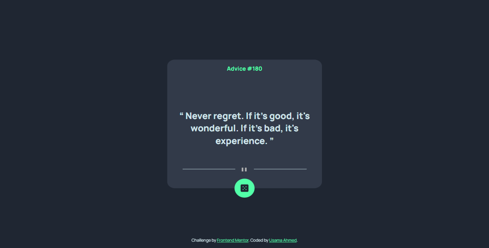

# Frontend Mentor - Advice generator app solution

This is a solution to the [Advice generator app challenge on Frontend Mentor](https://www.frontendmentor.io/challenges/advice-generator-app-QdUG-13db). Frontend Mentor challenges help you improve your coding skills by building realistic projects.

## Table of contents

- [Overview](#overview)
  - [Links](#links)
  - [Screenshot](#screenshot)
  - [Built with](#built-with)
  - [Author](#author)
  - [Slip Advice Api](#Slip-Advice-Api)

## Overview

 

## Links

- Solution URL: [link](https://github.com/UsamaBinKashif/advice-generator-app)
- Live Site URL: [link](https://advicegeneratorapp.vercel.app/)

 

## Screenshot

 

## Built with

- HTML
- SCSS
- Javascript
- Slip Advice Api

 

## Slip-Advice-Api

The Advice Slip API is a public API which generates random advices. The Advice Slip API endpoint is located at http://api.adviceslip.com/advice

 

## Author

- Website - [Usama Bin Kashif](https://github.com/UsamaBinKashif)
- Frontend Mentor - [@UsamaBinKashif](https://www.frontendmentor.io/profile/UsamaBinKashif)
- Twitter - [@UsamaBinKashif](https://twitter.com/UsamaBinKashif)
